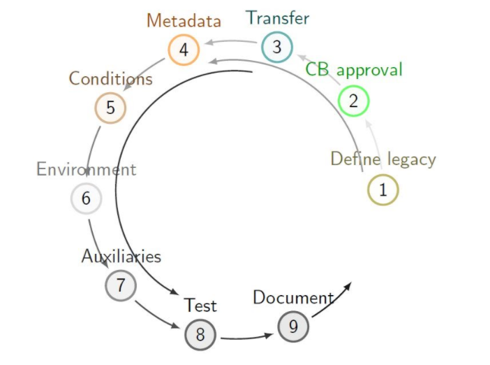
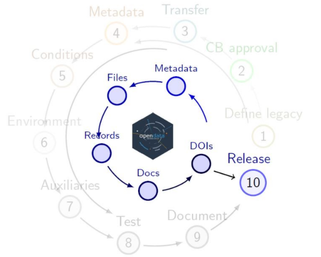

# Release preparations

The CMS open data are released through [the CMS open data portal](http://opendata.cern.ch/). The preparation consists of several steps:

- "Legacy" reprocessing is defined for the collision data and MC
- The data release is proposed for approval in the CMS Collaboration Board (CB)
- The datasets are transferred from their CMS storage to the open data area (eospublic at CERN)
- The metadata are extracted and parsed from the CMS-internal databases
- The condition data (needed for running the jobs) are extracted as sqlite files and stored on the cvmfs file system
- The computing environment (containers and VM image) is preserved and tested
- Auxiliar information (list of good runs, luminosity information etc) is collected 
- Testing in the open data environment
- Documentation for data usage and tools.

Based on this information, the open data portal records are prepared:

  